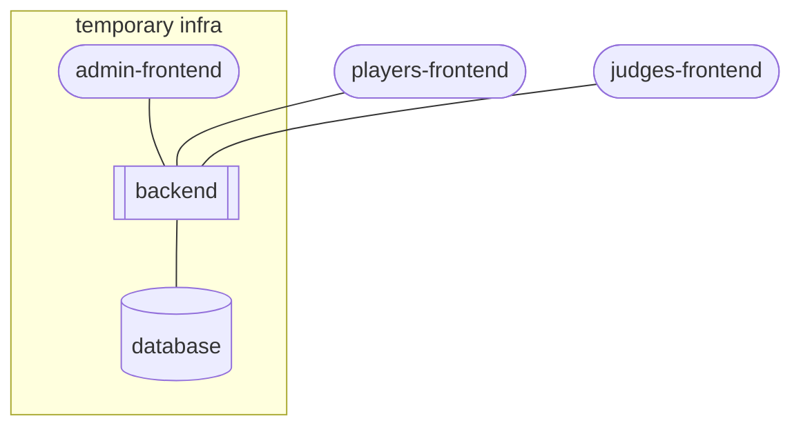

## pilot backend

when the game is not running, the content of the website is basically static.

on the other hand during the game, the updates needs to be in real time.

based on that, the backend can be provisioned only for a game.

when the game finishes, the static data of that game is generated as file and the environment is desprovisionsed. it's a way to create a economic and sustainable application.

### a draft for the architecture

### Components

- `players-frontend`: that's the amazing app used for the pilot
  - _nice to have_: the submission must be done using only the camera, to reinforce the real time behavior of the game
- `judges-frontend`: a simple app used by judge (or judges) to accept or reject the team submissions
  - it can be the same app, or another one reusing some components
  - if it's another one, it would be nice to create some libraries to share the code
- `admin-frontend`: used to create a game, edit challenges, points, rules and all the game related data
- `backend`: a web api responsible for receive and store the submissions from the teams
  - _nice to have_: the backend can notify the teams about new events
- `database`: database used during the game to store all the game data

### Some notes

- **authentication**: since there're different roles and apps, an authentication becomes necessary
  - _nice to have_: social login
- use **iac** to easily provisioning and desprovisiong the infra
- at the end of the game, the backend must generate and store a static file with the game data to be used by the frontend
  - this file can be stored in the code, as today, or in a external service file storage
  - the same goes for the images submitted by the teams
- **strapi**
  - the backend can be write using strapi, a headless cms in typescript
    - https://docs.strapi.io/
  - it provides a rest api (or a graphql api) that can be used by `players-frontend` and `judged-frontend`
    - https://docs.strapi.io/dev-docs/api/rest
    - https://docs.strapi.io/dev-docs/api/graphql
  - it also provides a admin panel that can be the `admin-frontend`
    - https://docs.strapi.io/user-docs/getting-started/setting-up-admin-panel
  - the authentication can be easily solved as well:
    - https://docs.strapi.io/dev-docs/plugins/users-permissions
    - https://docs.strapi.io/dev-docs/configurations/sso
